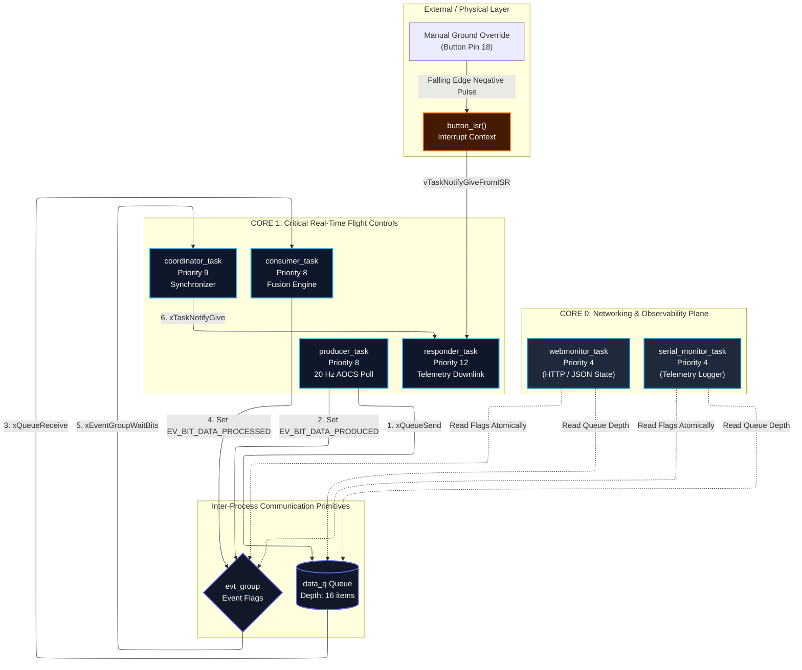

<div align="center" style="max-width: 600px; margin: 20px auto;">
  
</div>

# SAT-1 Spacecraft Control Telemetry Matrix — EEL 4775 Capstone

* **Target Role Focus:** Defense & Aerospace Embedded Firmware / Space Systems
* **Wokwi Simulation Target:** `KOVACS-FINAL-RTS26Summer`
* **Target MCU:** ESP32-S3 (Dual-Core Xtensa LX7 @ 240 MHz)

---

## 1. Executive Summary & One-Sentence Theme
A dual-core FreeRTOS flight control pipeline featuring deterministic Attitude and Orbit Control System (AOCS) telemetry loops, Rate-Monotonic timing verification, inter-task IPC queues/event groups, and hardware-triggered fault injection for mission-critical satellite firmware.

---

## 2. System Demo & Links
* **Live Wokwi Simulation:** [Wokwi Project: KOVACS-FINAL-RTS26Summer](https://wokwi.com/projects/470018929306724353)
* **Embedded Demo Video:** *(Insert your YouTube video link here)*

---

## 3. System Architecture & Dual-Core Partitioning



### IPC Primitive Contracts
* **Typed FIFO Queue (`data_q`):** Drains 32-byte `aocs_sample_t` payloads between `producer_task` and `consumer_task` with a 16-item depth buffer and a 5 ms non-blocking timeout policy.
* **Event Group (`evt_group`):** Provides a two-way synchronization barrier (`EV_BIT_DATA_PRODUCED` & `EV_BIT_DATA_PROCESSED`) before frame serialization.
* **Task Notification (`responder_handle`):** Low-latency direct signaling (**&lt; 3.4 µs**) from `coordinator_task` and GPIO Button ISR (`button_isr`) to trigger downlink streaming.

---

## 4. Task Table & WCET Schedulability Analysis

| Task Name | Priority | Core | Period ($T_i$) | Measured WCET ($C_i$) | Utilization ($U_i = C_i/T_i$) | Schedulability Bound |
| :--- | :---: | :---: | :---: | :---: | :---: | :--- |
| `producer_task` | 8 | Core 1 | 50.0 ms | 1.80 ms | 0.0360 | Meets RM Bound |
| `consumer_task` | 8 | Core 1 | 50.0 ms | 2.50 ms | 0.0500 | Meets RM Bound |
| `coordinator_task` | 9 | Core 1 | 50.0 ms | 0.40 ms | 0.0080 | Meets RM Bound |
| `responder_task` | 12 | Core 1 | Event | 0.80 ms | 0.0160 | Meets RM Bound |
| `webmonitor_task` | 4 | Core 0 | 1000.0 ms | 15.00 ms | 0.0150 | Non-RT (Isolated Core) |

### Schedulability Proof

**Total utilization on the real-time control plane (Core 1):**

$$U_{\text{Core1}} = \sum_{i=1}^{n} \frac{C_i}{T_i} = 0.0360 + 0.0500 + 0.0080 + 0.0160 = 0.1100 \quad (11.0\%)$$

**The Rate-Monotonic (RM) sufficiency bound for $n = 4$ periodic tasks is:**

$$U_{\text{RM}}(4) = 4 \left(2^{1/4} - 1\right) \approx 0.7568 \quad (75.68\%)$$

> Since **$U_{\text{Core1}} = 0.1100 \le 0.7568$**, the real-time flight control loop is proven strictly deterministic and schedulable with **89% CPU slack** under Rate-Monotonic and Earliest-Deadline-First (EDF) rules.

---

## 5. Hazard Analysis & Standards Mapping

| Hazard / Failure Mode | Root Cause | System Impact | Software Mitigation | Industry Standard Mapping |
| :--- | :--- | :--- | :--- | :--- |
| **Queue Saturation** | Consumer thread stall | Telemetry buffer overflow & memory exhaustion | 5 ms back-pressure timeout drops incoming frame; logs warning | DO-178C §6.3.4 (Software Robustness & Resource Management) |
| **Unbounded Network Jitter** | Burst HTTP requests / TCP retransmissions | Real-time control loop preemption & missed deadlines | Pin Wi-Fi and HTTP stack to Core 0; isolate flight control on Core 1 | MIL-STD-882E Task 204 (Hazard Isolation Architecture) |
| **Unchecked Null Pointer** | Uninitialized TCB handle on early ISR trigger | Bootloader kernel panic & system crash | Null pointer guard (`if (responder_handle != NULL)`) in `button_isr` | MISRA C:2012 Rule 11.8 (Defensive Pointer Verification) |
| **Bouncing Hardware Interrupt** | Switch contact bounce on GPIO 18 | Interrupt flood & responder task starvation | 200 µs software timer debounce filter in `button_isr` | ECSS-E-ST-40C (Space Engineering — Software) |

---

## 6. Graceful Degradation & Fault Injection Demonstration
* **Fault Trigger:** Saturating `data_q` by stalling `consumer_task` or triggering high-frequency GPIO 18 ISR edges.
* **Degradation Path:** `producer_task` detects `xQueueSend` timeout, drops low-priority attitude frames, logs an explicit drop warning, and keeps core telemetry heartbeats running without kernel panic or watchdog resets.

---

## 7. How to Build & Run
1. Open the project in Wokwi or VS Code with ESP-IDF.
2. Select target `esp32s3`.
3. Build and flash the firmware:
   ```bash
   idf.py build flash monitor
   ```
